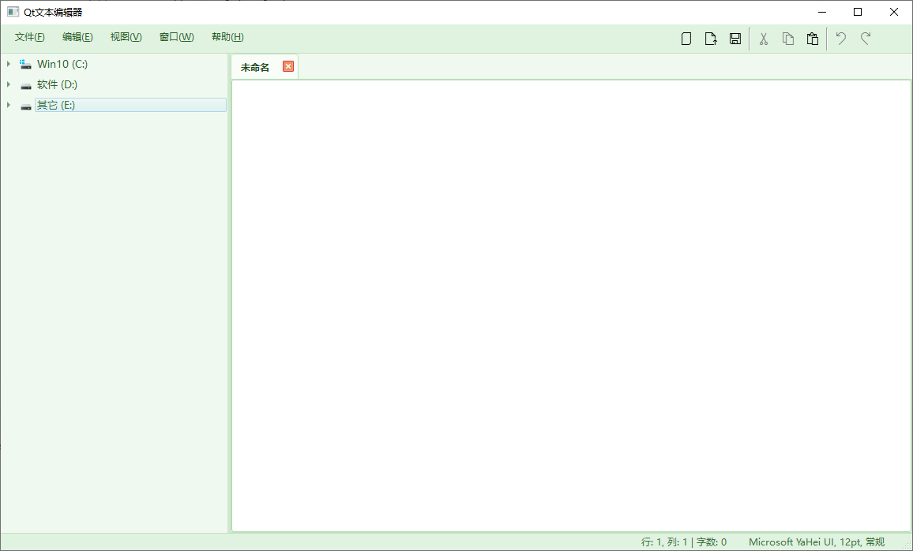

# Qt文本编辑器
这是一个使用Qt 6开发的现代化文本编辑器，具有多标签页编辑、文件树浏览、主题切换等丰富功能。编辑器设计简洁直观，适合日常文本编辑和代码编写需求。

## 功能特点
* 多标签页编辑：支持同时打开多个文件，每个文件在独立的标签页中编辑

* 文件树浏览：内置文件系统浏览器，可浏览目录结构并快速打开文件

* 主题切换：提供多种主题选择（淡绿色、深色、浅蓝色、经典）

* 查找替换：支持高级查找替换功能，包括区分大小写和全字匹配

* 字体设置：可自定义编辑器字体

* 状态栏信息：实时显示光标位置（行/列）和字数统计

* 上下文菜单：在文件树上可新建文件/文件夹、重命名、删除

* 快捷键支持：常用操作均有快捷键支持

* 自动保存设置：记住窗口大小、位置和主题偏好

## 安装与编译
### 依赖
* Qt 6.5+

* CMake 3.19+

编译步骤
```bash
mkdir build
cd build
cmake .. -DCMAKE_PREFIX_PATH="您的Qt安装路径"  # 例如：D:/Qt/6.9.1/mingw_64
cmake --build .
```
### 运行
编译完成后，在build目录下执行生成的可执行文件。

## 使用说明
1. 文件操作：
   + 新建文件：文件 → 新建 或 Ctrl+N

   + 打开文件：文件 → 打开 或 Ctrl+O

   + 保存文件：文件 → 保存 或 Ctrl+S

   + 另存为：文件 → 另存为 或 Ctrl+Shift+S

2. 编辑功能：

   + 撤销/重做：编辑 → 撤销/重做 或 Ctrl+Z/Ctrl+Y

   + 复制/粘贴/剪切：标准快捷键 Ctrl+C/Ctrl+V/Ctrl+X

   + 查找：编辑 → 查找 或 Ctrl+F

   + 替换：编辑 → 替换 或 Ctrl+R

3. 视图选项：

   + 切换侧边栏：视图 → 显示/隐藏侧边栏 或 Ctrl+Shift+L

   + 切换主题：视图 → 主题 → 选择主题

   + 文件树操作：

   + 右键点击文件树可：

   + 新建文件/文件夹

   + 重命名文件/文件夹

   + 删除文件/文件夹

## 界面预览


## 技术细节
* 使用Qt的QTextEdit作为核心编辑器组件

* 实现自定义样式表支持主题切换

* 使用QSettings保存用户偏好设置

* 基于QFileSystemModel实现文件树浏览

* 多标签页管理使用QTabWidget

## 贡献与改进
* 欢迎提交Issue或Pull Request来改进此项目。当前可改进的方向包括：

* 添加更多主题支持

* 实现语法高亮功能

* 增强文件管理功能

* 优化查找替换算法